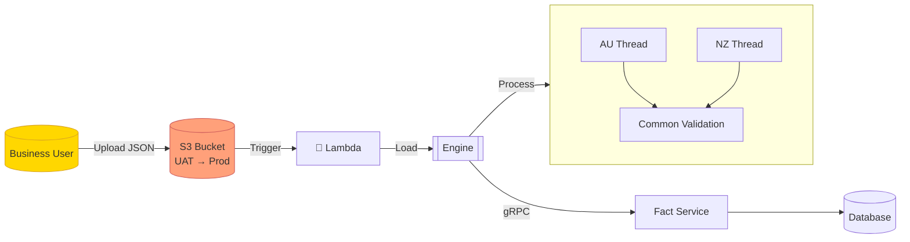

Sure! Below is the complete code for `FactService`, `RuleService`, `S3Service`, and `RuleEngineWrapper`, along with their respective test files.

### FactService

#### FactService Code

```typescript
// services/FactService.ts
import pgPromise from 'pg-promise';
import logger from '../logger';

type FactData = Record<string, any>;

class FactService {
  private db: pgPromise.IDatabase<any>;

  constructor() {
    const pgp = pgPromise();
    this.db = pgp({
      host: process.env.RDS_HOST,
      port: parseInt(process.env.RDS_PORT, 10),
      user: process.env.RDS_USER,
      password: process.env.RDS_PASSWORD,
      database: process.env.RDS_DATABASE,
    });
  }

  async fetchFactData<T>(query: string): Promise<T[]> {
    logger.debug('Fetching fact data from RDS', { query });
    const data = await this.db.any<T>(query);
    logger.debug('Fact data fetched from RDS', { data });
    return data;
  }
}

export default FactService;
```

#### FactService Test

```typescript
// tests/FactService.test.ts
import FactService from '../services/FactService';
import pgPromise from 'pg-promise';

jest.mock('pg-promise');

describe('FactService', () => {
  let factService: FactService;
  let db: any;

  beforeAll(() => {
    db = {
      any: jest.fn(),
    };
    (pgPromise as jest.Mock).mockReturnValue(() => db);
    factService = new FactService();
  });

  afterEach(() => {
    jest.clearAllMocks();
  });

  it('should fetch fact data from RDS', async () => {
    const query = 'SELECT * FROM facts';
    const expectedResult = [{ id: 1, name: 'fact1' }];
    db.any.mockResolvedValue(expectedResult);

    const result = await factService.fetchFactData(query);

    expect(db.any).toHaveBeenCalledWith(query);
    expect(result).toEqual(expectedResult);
  });
});
```

### RuleService

#### RuleService Code

```typescript
// services/RuleService.ts
import { Engine, Rule, Fact, Almanac, Event } from 'json-rules-engine';
import logger from '../logger';

type DynamicFact = (params: any, almanac: Almanac) => Promise<any>;

class RuleService {
  private engine: Engine;

  constructor() {
    this.engine = new Engine();
    logger.info('Rule engine initialized');
  }

  addRules(rules: Rule[]): void {
    for (const rule of rules) {
      this.engine.addRule(rule);
    }
    logger.info('Rules added to the engine', { rules });
  }

  async evaluateRules(dynamicFacts: Record<string, DynamicFact>): Promise<Event[]> {
    for (const [factId, factFn] of Object.entries(dynamicFacts)) {
      this.engine.addFact(factId, factFn);
    }
    logger.debug('Dynamic facts added to the engine', { dynamicFacts });

    const { events } = await this.engine.run({});
    logger.info('Rules evaluated', { events });
    return events as Event[];
  }
}

export default RuleService;
```

#### RuleService Test

```typescript
// tests/RuleService.test.ts
import { Engine, Rule, Fact, Almanac, Event } from 'json-rules-engine';
import RuleService from '../services/RuleService';

jest.mock('json-rules-engine');

describe('RuleService', () => {
  let ruleService: RuleService;
  let engine: any;

  beforeAll(() => {
    engine = {
      addRule: jest.fn(),
      addFact: jest.fn(),
      run: jest.fn(),
    };
    (Engine as jest.Mock).mockReturnValue(engine);
    ruleService = new RuleService();
  });

  afterEach(() => {
    jest.clearAllMocks();
  });

  it('should add rules to the engine', () => {
    const rules: Rule[] = [
      new Rule({
        conditions: {
          all: [{ fact: 'fact1', operator: 'equal', value: true }],
        },
        event: {
          type: 'event1',
          params: { message: 'Event triggered' },
        },
      }),
    ];

    ruleService.addRules(rules);

    expect(engine.addRule).toHaveBeenCalledTimes(rules.length);
    rules.forEach((rule) => expect(engine.addRule).toHaveBeenCalledWith(rule));
  });

  it('should evaluate rules with dynamic facts', async () => {
    const dynamicFacts: Record<string, Fact> = {
      fact1: async (params: any, almanac: Almanac) => true,
    };
    const expectedEvents: Event[] = [{ type: 'event1', params: { message: 'Event triggered' } }];
    engine.run.mockResolvedValue({ events: expectedEvents });

    const result = await ruleService.evaluateRules(dynamicFacts);

    expect(engine.addFact).toHaveBeenCalledTimes(Object.keys(dynamicFacts).length);
    Object.entries(dynamicFacts).forEach(([factId, factFn]) =>
      expect(engine.addFact).toHaveBeenCalledWith(factId, factFn)
    );
    expect(engine.run).toHaveBeenCalled();
    expect(result).toEqual(expectedEvents);
  });
});
```

### S3Service

#### S3Service Code

```typescript
// services/S3Service.ts
import { S3 } from 'aws-sdk';
import * as dotenv from 'dotenv';
import logger from '../logger';

// Load environment variables from .env file
dotenv.config();

class S3Service {
  private s3: S3;

  constructor() {
    const forcePathStyle = process.env.FORCE_PATH_STYLE === 'true';
    const endpoint = process.env.S3_ENDPOINT;

    this.s3 = new S3({
      credentials: {
        accessKeyId: process.env.AWS_ACCESS_KEY_ID!,
        secretAccessKey: process.env.AWS_SECRET_ACCESS_KEY!,
      },
      region: process.env.AWS_REGION,
      s3ForcePathStyle: forcePathStyle,
      endpoint: endpoint
    });
    logger.info('S3 service initialized', { forcePathStyle, endpoint });
  }

  async fetchRulesFromS3<T>(bucket: string, key: string): Promise<T> {
    const params = { Bucket: bucket, Key: key };
    logger.debug('Fetching rules from S3', { bucket, key });
    const data = await this.s3.getObject(params).promise();
    const rules = JSON.parse(data.Body.toString('utf-8')) as T;
    logger.debug('Rules fetched from S3', { rules });
    return rules;
  }
}

export default S3Service;
```

#### S3Service Test

```typescript
// tests/S3Service.test.ts
import S3Service from '../services/S3Service';
import { S3 } from 'aws-sdk';
import * as dotenv from 'dotenv';

dotenv.config();

jest.mock('aws-sdk');

describe('S3Service', () => {
  let s3Service: S3Service;
  let s3: any;

  beforeAll(() => {
    s3 = {
      getObject: jest.fn().mockReturnThis(),
      promise: jest.fn(),
    };
    (S3 as jest.Mock).mockReturnValue(s3);
    s3Service = new S3Service();
  });

  afterEach(() => {
    jest.clearAllMocks();
  });

  it('should fetch rules from S3', async () => {
    const bucket = 'test-bucket';
    const key = 'test-key';
    const expectedRules = [{ conditions: { all: [] }, event: { type: 'test' } }];
    const s3Response = { Body: Buffer.from(JSON.stringify(expectedRules)) };
    s3.promise.mockResolvedValue(s3Response);

    const result = await s3Service.fetchRulesFromS3(bucket, key);

    expect(s3.getObject).toHaveBeenCalledWith({ Bucket: bucket, Key: key });
    expect(result).toEqual(expectedRules);
  });
});
```

### RuleEngineWrapper

#### RuleEngineWrapper Code

```typescript
// ruleEngineWrapper.ts
import FactService from './services/FactService';
import RuleService from './services/RuleService';
import S3Service from './services/S3Service';
import { Rule, Fact, Event } from 'json-rules-engine';

type DynamicFact = (params: any, almanac: any) => Promise<any>;

class RuleEngineWrapper {
  private factService: FactService;
  private ruleService: RuleService;
  private s3Service: S3Service;

  constructor() {
    this.factService = new FactService();
    this.ruleService = new RuleService();
    this.s3Service = new S3Service();
  }

  async fetchFactData<T>(query: string): Promise<T[]> {
    return this.factService.fetchFactData(query);
  }

  async evaluateRules(rules: Rule[], dynamicFacts: Record<string, DynamicFact>): Promise<Event[]> {
    this.ruleService.addRules(rules);
    return this.ruleService.evaluateRules(dynamicFacts);
  }

  async fetchRulesFromS3<T>(bucket: string, key: string): Promise<T> {
    return this.s3Service.fetchRulesFromS3(bucket, key);
  }
}

export default RuleEngineWrapper;
```

#### RuleEngineWrapper Test

```typescript
// tests/RuleEngineWrapper.test.ts
// tests/RuleEngineWrapper.test.ts
import RuleEngineWrapper from '../ruleEngineWrapper';
import FactService from '../services/FactService';
import RuleService from '../services/RuleService';
import S3Service from '../services/S3Service';
import { Rule, Event, Fact } from 'json-rules-engine';

jest.mock('../services/FactService');
jest.mock('../services/RuleService');
jest.mock('../services/S3Service');

describe('RuleEngineWrapper', () => {
  let ruleEngineWrapper: RuleEngineWrapper;
  let factService: any;
  let ruleService: any;
  let s3Service: any;

  beforeAll(() => {
    factService = new FactService();
    ruleService = new RuleService();
    s3Service = new S3Service();
    ruleEngineWrapper = new RuleEngineWrapper();
  });

  afterEach(() => {
    jest.clearAllMocks();
  });

  it('should fetch fact data', async () => {
    const query = 'SELECT * FROM facts';
    const expectedResult = [{ id: 1, name: 'fact1' }];
    factService.fetchFactData.mockResolvedValue(expectedResult);

    const result = await ruleEngineWrapper.fetchFactData(query);

    expect(factService.fetchFactData).toHaveBeenCalledWith(query);
    expect(result).toEqual(expectedResult);
  });

  it('should evaluate rules with dynamic facts', async () => {
    const rules: Rule[] = [
      new Rule({
        conditions: { all: [{ fact: 'fact1', operator: 'equal', value: true }] },
        event: { type: 'event1', params: { message: 'Event triggered' } },
      }),
    ];
    const dynamicFacts: Record<string, Fact> = {
      fact1: async (params: any, almanac: any) => true,
    };
    const expectedEvents: Event[] = [{ type: 'event1', params: { message: 'Event triggered' } }];
    ruleService.evaluateRules.mockResolvedValue(expectedEvents);

    const result = await ruleEngineWrapper.evaluateRules(rules, dynamicFacts);

    expect(ruleService.addRules).toHaveBeenCalledWith(rules);
    expect(ruleService.evaluateRules).toHaveBeenCalledWith(dynamicFacts);
    expect(result).toEqual(expectedEvents);
  });

  it('should fetch rules from S3', async () => {
    const bucket = 'test-bucket';
    const key = 'test-key';
    const expectedRules = [{ conditions: { all: [] }, event: { type: 'test' } }];
    s3Service.fetchRulesFromS3.mockResolvedValue(expectedRules);

    const result = await ruleEngineWrapper.fetchRulesFromS3(bucket, key);

    expect(s3Service.fetchRulesFromS3).toHaveBeenCalledWith(bucket, key);
    expect(result).toEqual(expectedRules);
  });
});


--------------------------------------------------***------------------------

Sure! Let's update the implementation to use AWS Lambda Powertools for logging and include logging statements.

### Directory Structure
```
project-root/
│
├── queries/
│   ├── index.ts
│
├── models/
│   ├── FactData.ts
│   ├── RuleConfig.ts
│
├── utils/
│   ├── logger.ts
│
├── dynamicFacts.ts
├── types.ts
├── handler.ts
├── rules.json
├── tests/
│   ├── handler.test.ts
│   ├── dynamicFacts.test.ts
│
├── .env
└── package.json
```

### Queries

#### index.ts
```typescript
export const getMarketSegmentsQuery = `
  SELECT market_segment_code, calendar_id
  FROM market_segment
  WHERE start_date <= NOW() AND end_date >= NOW()
`;

export const getNextTradingDateQuery = (calendarId: string) => `
  SELECT MIN(c.trade_date) AS next_trade_date
  FROM calendar c
  WHERE c.calendar_id = '${calendarId}'
    AND c.trade_date > NOW()
    AND c.trade_date_indicator = 'Y'
`;

export const getEligibleInstrumentsQuery = (marketSegmentCode: string, nextTradingDate: string) => `
  SELECT 
    i.instrument_code,
    i.commodity_code,
    i.instrument_type,
    i.first_trading_date,
    i.last_trading_date,
    i.expiry_date,
    ac.commodity_code as applicable_commodity_code,
    ac.instrument_type as applicable_instrument_type,
    ttm.trade_type,
    ttm.commodity_code as trade_commodity_code,
    ttm.instrument_type as trade_instrument_type,
    ms.market_segment_code,
    c.trade_date
  FROM instruments i
  JOIN applicable_contracts ac ON i.commodity_code = ac.commodity_code AND i.instrument_type = ac.instrument_type
  JOIN trade_type_mapping ttm ON i.commodity_code = ttm.commodity_code AND i.instrument_type = ttm.instrument_type
  JOIN market_segment ms ON i.market_segment_code = ms.market_segment_code
  JOIN calendar c ON ms.calendar_id = c.calendar_id
  WHERE ms.market_segment_code = '${marketSegmentCode}'
    AND c.trade_date = '${nextTradingDate}'
    AND ttm.trade_type IN ('block', 'efp', 'delivery efp')
    AND i.commodity_code IN (SELECT commodity_code FROM applicable_contracts)
    AND i.market_segment_code = '${marketSegmentCode}'
    AND (
      (ttm.trade_type = 'delivery efp' AND c.trade_date BETWEEN i.last_trading_date AND i.expiry_date)
      OR (ttm.trade_type IN ('block', 'efp') AND c.trade_date BETWEEN i.first_trading_date AND i.last_trading_date)
    )
`;
```

### Models

#### FactData.ts
```typescript
export interface FactData {
  instrument_code: string;
  commodity_code: string;
  instrument_type: string;
  first_trading_date: string;
  last_trading_date: string;
  expiry_date: string;
  trade_type: string;
  trade_subtype: string;
  market_segment_code: string;
  // Add other fields as needed
}
```

#### RuleConfig.ts
```typescript
export interface RuleConfig {
  bucket: string;
  key: string;
  dynamicFacts: Record<string, any>;
}
```

### Utilities

#### logger.ts
```typescript
import { Logger } from '@aws-lambda-powertools/logger';

const logger = new Logger({ serviceName: 'YourServiceName' });

export default logger;
```

### Dynamic Facts

#### dynamicFacts.ts
```typescript
import { getMarketSegmentsQuery, getNextTradingDateQuery, getEligibleInstrumentsQuery } from './queries/index';
import { FactService, RuleService, S3Service } from 'your-library';
import logger from './utils/logger';

const ruleEngineWrapper = new RuleEngineWrapper(new FactService(process.env), new RuleService(), new S3Service());

const getMarketSegments = async () => {
  logger.info('Fetching market segments');
  const data = await ruleEngineWrapper.fetchFactData(getMarketSegmentsQuery);
  logger.info('Market segments fetched', { data });
  return data;
};

const getNextTradingDate = async (params, almanac) => {
  const marketSegments = await almanac.factValue("marketSegments");

  const queries = marketSegments.map(segment => getNextTradingDateQuery(segment.calendar_id));
  const promises = queries.map(query => ruleEngineWrapper.fetchFactData(query));
  const results = await Promise.all(promises);
  logger.info('Next trading dates fetched', { results });
  return results.map(res => res[0]);
};

const getEligibleInstruments = async (params, almanac) => {
  const marketSegments = await almanac.factValue("marketSegments");
  const nextTradingDates = await almanac.factValue("nextTradingDate");

  const queries = marketSegments.map((segment, index) => 
    getEligibleInstrumentsQuery(segment.market_segment_code, nextTradingDates[index].next_trade_date)
  );
  
  const promises = queries.map(query => ruleEngineWrapper.fetchFactData(query));
  const results = await Promise.all(promises);
  logger.info('Eligible instruments fetched', { results });
  return results.flat();
};

export const dynamicFacts: { [key: string]: any } = {
  marketSegments: getMarketSegments,
  nextTradingDate: getNextTradingDate,
  eligibleInstruments: getEligibleInstruments
};
```

### Lambda Handler

#### handler.ts
```typescript
import { APIGatewayProxyHandler } from 'aws-lambda';
import { dynamicFacts } from './dynamicFacts';
import { RuleConfig } from './models/RuleConfig';
import logger from './utils/logger';
import { RuleEngineWrapper, FactService, RuleService, S3Service } from 'your-library';

const ruleEngineWrapper = new RuleEngineWrapper(new FactService(process.env), new RuleService(), new S3Service());

export const handler: APIGatewayProxyHandler = async (event) => {
  try {
    logger.info('Handler invoked', { event });
    const { bucket, key } = JSON.parse(event.body!) as RuleConfig;

    // Fetch rules from S3
    const rules = await ruleEngineWrapper.fetchRulesFromS3(bucket, key);
    logger.info('Rules fetched from S3', { rules });

    // Evaluate rules with dynamic facts
    const results = await ruleEngineWrapper.evaluateRules(rules, dynamicFacts);
    logger.info('Rules evaluated', { results });

    return {
      statusCode: 200,
      body: JSON.stringify(results),
    };
  } catch (error) {
    logger.error('Error in handler', { error });
    return {
      statusCode: 500,
      body: JSON.stringify({ error: 'Internal Server Error' }),
    };
  }
};
```

### Rules Definition

#### rules.json
```json
[
  {
    "conditions": {
      "all": [
        {
          "fact": "marketSegments",
          "operator": "greaterThanInclusive",
          "value": "$today",
          "path": "$.market_segment_code"
        },
        {
          "fact": "nextTradingDate",
          "operator": "greaterThanInclusive",
          "value": "$today",
          "path": "$.next_trade_date"
        }
      ]
    },
    "event": {
      "type": "nextTradingDate",
      "params": {
        "message": "Next trading date found"
      }
    },
    "priority": 10
  },
  {
    "conditions": {
      "all": [
        {
          "fact": "eligibleInstruments",
          "operator": "greaterThanInclusive",
          "value": "$nextTradingDate",
          "path": "$.first_trading_date"
        },
        {
          "fact": "eligibleInstruments",
          "operator": "lessThanInclusive",
          "value": "$nextTradingDate",
          "path": "$.last_trading_date"
        },
        {
          "fact": "eligibleInstruments",
          "operator": "in",
          "value": ["block", "efp"],
          "path": "$.trade_subtype"
        },
        {
          "fact": "eligibleInstruments",
          "operator": "equal",
          "value": "$marketSegmentCode",
          "path": "$.market_segment_code"
        }
      ]
    },
    "event": {
      "type": "blockAndEfpInstrument",
      "params": {
        "message": "Block and EFP instrument is eligible"
      }
    },
    "priority": 5
  },
  {
    "conditions": {
      "all": [
        {
          "fact": "eligibleInstruments",
          "operator": "greaterThanInclusive",
          "value": "$nextTradingDate",
          "path": "$.last_trading_date"
        },
        {
          "fact": "eligibleInstruments",
          "operator": "lessThanInclusive",
          "value": "$nextTradingDate",
          "path": "$.expiry_date"
        },
        {
          "fact": "eligibleInstruments",
          "operator": "equal",
          "value": "delivery efp",
          "path": "$.trade_type"
        },
        {
          "fact": "eligibleInstruments",
          "operator": "equal",
          "value": "$marketSegmentCode",
          "path": "$.market_segment_code"
        }
      ]
    },
    "event": {
      "type": "deliveryEfpInstrument",
      "params": {
        "message": "Delivery EFP instrument is eligible"
      }
    },
    "priority": 5
  }


 async evaluateRulesWithParamsInjection(
    dynamicFacts: Record<string, DynamicFact>,
    paramsInjector: (event: Event, almanac: Almanac) => Promise<Record<string, any>>
  ): Promise<Event[]> {
    for (const [factId, factFn] of Object.entries(dynamicFacts)) {
      this.engine.addFact(factId, factFn);
    }
    logger.debug('Dynamic facts added to the engine', { dynamicFacts });

    const { events } = await this.engine.run({});

    // Inject additional parameters into event params
    for (const event of events) {
      const additionalParams = await paramsInjector(event, this.engine.almanac);
      Object.assign(event.params, additionalParams); // Merge additional params into event.params
    }

    logger.info('Rules evaluated with injected params', { events });
    return events as Event[];
  }


// Define a params injector function
const paramsInjector = async (event: Event, almanac: Almanac) => {
  const instrumentDetails = await almanac.factValue('instrumentDetails'); // Retrieve instrument details dynamically
  return { instrument_code: instrumentDetails.instrument_code }; // Inject instrument_code into event params
};


interface Instrument {
  trade_sub_type: string;
  commodity_code: string;
  instrument_type: string;
  instrument_code: string;
  expiry_date: string;
}

interface SequencedInstrument extends Instrument {
  sequence_number: number;
}

function assignSequenceNumbersByGroup(instruments: Instrument[]): SequencedInstrument[] {
  // Sort instruments by the group key and expiry_date to maintain order
  instruments.sort((a, b) => {
    return `${a.trade_sub_type}-${a.commodity_code}-${a.instrument_type}-${a.expiry_date}`.localeCompare(
      `${b.trade_sub_type}-${b.commodity_code}-${b.instrument_type}-${b.expiry_date}`
    );
  });

  const result: SequencedInstrument[] = [];
  let sequenceNumber = 0;
  let previousGroupKey = '';

  for (const instrument of instruments) {
    // Generate the group key based on trade_sub_type, commodity_code, instrument_type, and expiry_date
    const currentGroupKey = `${instrument.trade_sub_type}-${instrument.commodity_code}-${instrument.instrument_type}-${instrument.expiry_date}`;

    // Increment sequence number only if the group key changes
    if (currentGroupKey !== previousGroupKey) {
      sequenceNumber++; // Increment sequence number for the new group
      previousGroupKey = currentGroupKey; // Update the previous group key
    }

    result.push({
      ...instrument,
      sequence_number: sequenceNumber,
    });
  }


To handle **multiple rules** where each rule is applied to an instrument sequentially, and if any rule fails for an instrument, that instrument is skipped, we can refactor the code to process each instrument individually. This ensures that if an instrument fails a rule, it is discarded immediately, and the next instrument is processed.

Here’s how we can achieve this:

---

### **1. Key Requirements**
1. **Load All Instruments at Once:** Fetch all instruments from the database in a single query.
2. **Process Each Instrument Individually:** Apply rules sequentially to each instrument.
3. **Skip Instrument if Any Rule Fails:** If an instrument fails any rule, discard it and move to the next instrument.
4. **Store Valid Instruments:** Only instruments that pass all rules are stored in the database.

---

### **2. Refactored Code Structure**
We will refactor the code into the following components:
1. **Instrument Loader:** Fetches all instruments from the database.
2. **Rule Handlers:** Apply rules sequentially to each instrument.
3. **Instrument Processor:** Loops through each instrument and applies the rule chain.
4. **Database Storage Handler:** Stores valid instruments in the database.

---

### **3. Refactored Implementation**

#### **3.1. Instrument Loader**
This component is responsible for loading all instruments from the database at once.

```typescript
class InstrumentLoader {
  async loadInstruments(): Promise<any[]> {
    console.log("Loading all instruments from the database...");
    const instruments = await loadAllInstrumentsFromDB(); // Fetch all instruments
    return instruments;
  }
}

// Helper function to simulate database query
async function loadAllInstrumentsFromDB(): Promise<any[]> {
  return [
    { id: "1", rule1Condition: true, rule2Condition: true },
    { id: "2", rule1Condition: false, rule2Condition: true }, // Fails Rule 1
    { id: "3", rule1Condition: true, rule2Condition: false }, // Fails Rule 2
    { id: "4", rule1Condition: true, rule2Condition: true },
  ];
}
```

---

#### **3.2. Rule Handlers**
Each rule handler applies a specific rule to the instrument. If the rule fails, it throws an error.

```typescript
abstract class RuleHandler {
  private nextHandler: RuleHandler | null = null;

  setNext(handler: RuleHandler): RuleHandler {
    this.nextHandler = handler;
    return handler;
  }

  async handle(instrument: any): Promise<any> {
    try {
      // Apply the rule
      const processedInstrument = await this.applyRule(instrument);

      // Pass to the next rule handler
      if (this.nextHandler) {
        return this.nextHandler.handle(processedInstrument);
      }

      // Return the instrument if no more handlers
      return processedInstrument;
    } catch (error) {
      // Stop processing for this instrument if the rule fails
      throw error;
    }
  }

  // Abstract method to be implemented by concrete handlers
  abstract applyRule(instrument: any): Promise<any>;
}

class Rule1Handler extends RuleHandler {
  async applyRule(instrument: any): Promise<any> {
    console.log(`Applying Rule 1 to instrument ${instrument.id}`);
    if (!instrument.rule1Condition) {
      throw new Error(`Instrument ${instrument.id} failed Rule 1`);
    }
    return instrument;
  }
}

class Rule2Handler extends RuleHandler {
  async applyRule(instrument: any): Promise<any> {
    console.log(`Applying Rule 2 to instrument ${instrument.id}`);
    if (!instrument.rule2Condition) {
      throw new Error(`Instrument ${instrument.id} failed Rule 2`);
    }
    return instrument;
  }
}
```

---

#### **3.3. Instrument Processor**
This component loops through each instrument and applies the rule chain. If an instrument passes all rules, it is added to the list of valid instruments.

```typescript
class InstrumentProcessor {
  private ruleHandlerChain: RuleHandler;

  constructor(ruleHandlerChain: RuleHandler) {
    this.ruleHandlerChain = ruleHandlerChain;
  }

  async processInstruments(instruments: any[]): Promise<any[]> {
    const validInstruments: any[] = [];

    for (const instrument of instruments) {
      try {
        // Apply the rule chain to the instrument
        const processedInstrument = await this.ruleHandlerChain.handle(instrument);
        validInstruments.push(processedInstrument);
      } catch (error) {
        console.error(`Instrument ${instrument.id} failed:`, error.message);
      }
    }

    return validInstruments;
  }
}
```

---

#### **3.4. Database Storage Handler**
This component stores valid instruments in the database.

```typescript
class DatabaseStorageHandler {
  async storeInstruments(instruments: any[]): Promise<void> {
    console.log("Storing valid instruments in the database...");
    for (const instrument of instruments) {
      await storeInstrumentInDB(instrument);
    }
  }
}

// Helper function to simulate database storage
async function storeInstrumentInDB(instrument: any): Promise<void> {
  console.log(`Storing instrument ${instrument.id}`);
}
```

---

#### **3.5. Lambda Handler**
The Lambda handler sets up the chain of responsibility, loads all instruments, processes them, and stores the valid ones.

```typescript
const handler = async (event: any) => {
  const instrumentLoader = new InstrumentLoader();
  const instruments = await instrumentLoader.loadInstruments();

  const rule1Handler = new Rule1Handler();
  const rule2Handler = new Rule2Handler();
  rule1Handler.setNext(rule2Handler);

  const instrumentProcessor = new InstrumentProcessor(rule1Handler);
  const validInstruments = await instrumentProcessor.processInstruments(instruments);

  const dbHandler = new DatabaseStorageHandler();
  await dbHandler.storeInstruments(validInstruments);

  return {
    statusCode: 200,
    body: JSON.stringify({ message: "Processing complete", validInstruments }),
  };
};

export { handler };
```

---

### **4. Test Cases**

We will use a testing framework like **Jest** to write test cases.

#### **4.1. Setup Jest**
Install Jest if not already installed:

```bash
npm install --save-dev jest
```

Add a `jest.config.js` file:

```javascript
module.exports = {
  testEnvironment: "node",
};
```

---

#### **4.2. Test Cases**

```typescript
const { handler } = require("./path/to/your/lambda/handler");

describe("Instrument Processing", () => {
  it("should load instruments, apply rules, and store valid instruments", async () => {
    const event = {}; // Mock event
    const result = await handler(event);

    // Check if the response is correct
    expect(result.statusCode).toBe(200);
    expect(result.body).toContain("Processing complete");

    // Check if valid instruments are stored
    const responseBody = JSON.parse(result.body);
    expect(responseBody.validInstruments).toEqual([
      { id: "1", rule1Condition: true, rule2Condition: true },
      { id: "4", rule1Condition: true, rule2Condition: true },
    ]);
  });

  it("should discard instruments that fail Rule 1", async () => {
    const instruments = [
      { id: "1", rule1Condition: true, rule2Condition: true },
      { id: "2", rule1Condition: false, rule2Condition: true }, // Fails Rule 1
    ];

    const rule1Handler = new Rule1Handler();
    const instrumentProcessor = new InstrumentProcessor(rule1Handler);
    const validInstruments = await instrumentProcessor.processInstruments(instruments);

    expect(validInstruments).toEqual([
      { id: "1", rule1Condition: true, rule2Condition: true },
    ]);
  });

  it("should discard instruments that fail Rule 2", async () => {
    const instruments = [
      { id: "1", rule1Condition: true, rule2Condition: true },
      { id: "3", rule1Condition: true, rule2Condition: false }, // Fails Rule 2
    ];

    const rule1Handler = new Rule1Handler();
    const rule2Handler = new Rule2Handler();
    rule1Handler.setNext(rule2Handler);

    const instrumentProcessor = new InstrumentProcessor(rule1Handler);
    const validInstruments = await instrumentProcessor.processInstruments(instruments);

    expect(validInstruments).toEqual([
      { id: "1", rule1Condition: true, rule2Condition: true },
    ]);
  });

  it("should handle empty instrument list", async () => {
    const instruments = [];

    const rule1Handler = new Rule1Handler();
    const instrumentProcessor = new InstrumentProcessor(rule1Handler);
    const validInstruments = await instrumentProcessor.processInstruments(instruments);

    expect(validInstruments).toEqual([]);
  });
});
```

---

### **5. Running Tests**
Run the tests using Jest:

```bash
npx jest
```

---

### **6. Expected Output**
- **Test 1:** Valid instruments (`id: 1` and `id: 4`) are processed and stored.
- **Test 2:** Instruments failing Rule 1 are discarded.
- **Test 3:** Instruments failing Rule 2 are discarded.
- **Test 4:** Empty instrument list is handled gracefully.

---

### **7. Benefits**
- **Efficient Processing:** Instruments are processed one at a time, ensuring rules are applied correctly.
- **Error Handling:** If a rule fails for an instrument, it is discarded immediately.
- **Modularity:** Each rule handler is independent and can be modified or extended easily.
- **Scalability:** New rules can be added to the chain without affecting existing logic.

This approach ensures that the system is robust, maintainable, and adheres to clean code principles while meeting the specific requirements.

  return result;
}


To better structure your code in a maintainable and modular way, here's how you can organize the different components into separate files. This approach adheres to clean code principles and ensures reusability and scalability.

---

### **Proposed Folder and File Structure**
Here's a suggested folder structure for your project:

```
src/
│
├── handlers/
│   ├── RuleHandler.ts
│   ├── Rule1Handler.ts
│   ├── Rule2Handler.ts
│   ├── SequencingHandler.ts
│   ├── Rule3Handler.ts
│
├── processors/
│   ├── InstrumentProcessor.ts
│
├── utils/
│   ├── SequencingUtil.ts
│   ├── DatabaseStorageHandler.ts
│
├── loaders/
│   ├── InstrumentLoader.ts
│
├── types/
│   ├── Instrument.ts
│
├── tests/
│   ├── LambdaHandler.test.ts
│
├── lambda/
│   ├── Handler.ts
│
├── index.ts
```

---

### **Detailed Breakdown**
1. **`handlers/` Folder:**
   - Contains all the rule handlers, each implementing specific logic while inheriting from the abstract `RuleHandler`.

   **Example: RuleHandler.ts**
   ```typescript
   export abstract class RuleHandler {
     private nextHandler: RuleHandler | null = null;

     setNext(handler: RuleHandler): RuleHandler {
       this.nextHandler = handler;
       return handler;
     }

     async handle(instrument: any): Promise<any> {
       if (!(await this.applyRule(instrument))) {
         console.log(`Instrument ${instrument.id} failed ${this.constructor.name}`);
         return null;
       }
       return this.nextHandler ? this.nextHandler.handle(instrument) : instrument;
     }

     abstract applyRule(instrument: any): Promise<boolean>;
   }
   ```

   **Example: Rule1Handler.ts**
   ```typescript
   import { RuleHandler } from "./RuleHandler";

   export class Rule1Handler extends RuleHandler {
     async applyRule(instrument: any): Promise<boolean> {
       return instrument.rule1Condition || false;
     }
   }
   ```

   Repeat for `Rule2Handler`, `SequencingHandler`, and `Rule3Handler`.

2. **`processors/` Folder:**
   - Contains the core `InstrumentProcessor`, which is responsible for processing the instruments.

   **Example: InstrumentProcessor.ts**
   ```typescript
   import { RuleHandler } from "../handlers/RuleHandler";

   export class InstrumentProcessor {
     private ruleHandlerChain: RuleHandler;

     constructor(ruleHandlerChain: RuleHandler) {
       this.ruleHandlerChain = ruleHandlerChain;
     }

     async processInstruments(instruments: any[]): Promise<any[]> {
       const processedInstruments = [];
       for (const instrument of instruments) {
         const result = await this.ruleHandlerChain.handle(instrument);
         if (result) {
           processedInstruments.push(result);
         }
       }
       return processedInstruments;
     }
   }
   ```

3. **`utils/` Folder:**
   - Contains utility functions or classes for generic operations like sequencing and database handling.

   **Example: SequencingUtil.ts**
   ```typescript
   export function assignSequenceNumbersByGroup(instruments: any[]): any[] {
     instruments.sort((a, b) => {
       return `${a.trade_sub_type}-${a.commodity_code}-${a.instrument_type}-${a.expiry_date}`.localeCompare(
         `${b.trade_sub_type}-${b.commodity_code}-${b.instrument_type}-${b.expiry_date}`
       );
     });

     let sequenceNumber = 0;
     let previousGroupKey = "";
     const result = [];

     for (const instrument of instruments) {
       const currentGroupKey = `${instrument.trade_sub_type}-${instrument.commodity_code}-${instrument.instrument_type}-${instrument.expiry_date}`;
       if (currentGroupKey !== previousGroupKey) {
         sequenceNumber++;
         previousGroupKey = currentGroupKey;
       }
       result.push({ ...instrument, sequence_number: sequenceNumber });
     }

     return result;
   }
   ```

   **Example: DatabaseStorageHandler.ts**
   ```typescript
   export class DatabaseStorageHandler {
     async storeInstruments(instruments: any[]): Promise<void> {
       console.log("Storing instruments:", instruments.map((i) => i.id).join(", "));
     }
   }
   ```

4. **`loaders/` Folder:**
   - Contains the `InstrumentLoader`, which fetches instruments from the database.

   **Example: InstrumentLoader.ts**
   ```typescript
   export class InstrumentLoader {
     async loadInstruments(): Promise<any[]> {
       return [
         { id: "1", rule1Condition: true, rule2Condition: true, rule3Condition: true },
         { id: "2", rule1Condition: false, rule2Condition: true, rule3Condition: true },
       ];
     }
   }
   ```

5. **`types/` Folder:**
   - Contains type definitions for clarity and strict type-checking.

   **Example: Instrument.ts**
   ```typescript
   export type Instrument = {
     id: string;
     trade_sub_type: string;
     commodity_code: string;
     instrument_type: string;
     expiry_date: string;
     rule1Condition?: boolean;
     rule2Condition?: boolean;
     rule3Condition?: boolean;
   };
   ```

6. **`tests/` Folder:**
   - Contains test files for unit and integration testing.

   **Example: LambdaHandler.test.ts**
   ```typescript
   import { handler } from "../lambda/Handler";

   describe("Lambda Handler", () => {
     it("should process instruments correctly", async () => {
       const response = await handler({});
       expect(response.statusCode).toBe(200);
       const body = JSON.parse(response.body);
       expect(body.validInstruments.length).toBeGreaterThan(0);
     });
   });
   ```

7. **`lambda/` Folder:**
   - Contains the entry point for your Lambda function.

   **Example: Handler.ts**
   ```typescript
   import { InstrumentLoader } from "../loaders/InstrumentLoader";
   import { Rule1Handler } from "../handlers/Rule1Handler";
   import { Rule2Handler } from "../handlers/Rule2Handler";
   import { SequencingHandler } from "../handlers/SequencingHandler";
   import { Rule3Handler } from "../handlers/Rule3Handler";
   import { InstrumentProcessor } from "../processors/InstrumentProcessor";
   import { DatabaseStorageHandler } from "../utils/DatabaseStorageHandler";
   import { assignSequenceNumbersByGroup } from "../utils/SequencingUtil";

   export const handler = async (event: any) => {
     const loader = new InstrumentLoader();
     const instruments = await loader.loadInstruments();

     const rule1 = new Rule1Handler();
     const rule2 = new Rule2Handler();
     const sequencing = new SequencingHandler();
     const rule3 = new Rule3Handler();

     rule1.setNext(rule2).setNext(sequencing).setNext(rule3);

     const processor = new InstrumentProcessor(rule1);
     const validInstruments = await processor.processInstruments(instruments);

     const sequencedInstruments = assignSequenceNumbersByGroup(validInstruments);

     const dbHandler = new DatabaseStorageHandler();
     await dbHandler.storeInstruments(sequencedInstruments);

     return {
       statusCode: 200,
       body: JSON.stringify({ message: "Processing complete", validInstruments: sequencedInstruments }),
     };
   };
   ```

---

async batchInsertInstruments(instruments: any[]): Promise<void> {
    if (instruments.length === 0) {
      logger.info('No instruments to insert.');
      return;
    }

    // Define the table and columns for the bulk insert
    const table = new pgPromise.helpers.TableName('processed_instruments'); // Replace with your table name
    const columns = ['id', 'trade_date', 'rule1_condition', 'rule2_condition', 'rule3_condition', 'priority', 'sequence_number']; // Replace with your column names

    // Generate the bulk insert query
    const query = pgPromise.helpers.insert(instruments, columns, table);

    try {
      // Execute the bulk insert query
      await this.db.none(query);
      logger.info(`Successfully inserted ${instruments.length} instruments.`);
    } catch (error) {
      logger.error('Failed to insert instruments:', error);
      throw error;
    }
  }

  function mapInstrumentsToColumns(instruments: any[]): any[] {
  return instruments.map((instrument) => ({
    id: instrument.id, // Map instrument ID
    trade_date: instrument.tradeDate, // Map tradeDate to trade_date
    rule1_condition: instrument.rule1Condition, // Map rule1Condition to rule1_condition
    rule2_condition: instrument.rule2Condition, // Map rule2Condition to rule2_condition
    rule3_condition: instrument.rule3Condition, // Map rule3Condition to rule3_condition
    priority: instrument.priority, // Map priority
    sequence_number: instrument.sequenceNumber, // Map sequenceNumber to sequence_number
  }));
}

export default mapInstrumentsToColumns;

Sure! I’ll break the `mergeInstruments` method from your `FactService` class into smaller, reusable functions for clarity and maintainability. Each function will handle a specific part of the logic, resulting in cleaner, more modular code. Here's the refactored version:

---

### Refactored `FactService` with Smaller Functions

```typescript
import pgPromise from 'pg-promise';
import logger from '../logger';

class FactService {
  private db: pgPromise.IDatabase<any>;

  constructor() {
    const pgp = pgPromise();
    this.db = pgp({
      host: process.env.RDS_HOST,
      port: parseInt(process.env.RDS_PORT, 10),
      user: process.env.RDS_USER,
      password: process.env.RDS_PASSWORD,
      database: process.env.RDS_DATABASE,
    });
  }

  // Generic method to fetch data
  async fetchFactData<T>(query: string, params: any[] = []): Promise<T[]> {
    logger.debug('Fetching fact data', { query, params });
    return this.db.any<T>(query, params);
  }

  // Split function to prepare column names for placeholders
  private preparePlaceholders(
    data: Record<string, any>,
    specialFields: { dateFields: string[]; bitFields: string[]; timestampFields: string[] }
  ): string {
    const { dateFields, bitFields, timestampFields } = specialFields;

    return Object.keys(data)
      .map((key, index) => {
        if (dateFields.includes(key)) {
          return `$${index + 1}::DATE`;
        } else if (bitFields.includes(key)) {
          return `$${index + 1}::BIT(1)`;
        } else if (timestampFields.includes(key)) {
          return `$${index + 1}::TIMESTAMP`;
        }
        return `$${index + 1}`;
      })
      .join(', ');
  }

  // Split function to create ON condition dynamically
  private prepareOnCondition(onColumns: string[]): string {
    return onColumns.map((col) => `target.${col} = source.${col}`).join(' AND ');
  }

  // Split function to preprocess data for special fields
  private processData(
    data: Record<string, any>,
    specialFields: { dateFields: string[]; bitFields: string[]; timestampFields: string[] }
  ): any[] {
    const { dateFields, bitFields, timestampFields } = specialFields;

    return Object.keys(data).map((key) => {
      if (dateFields.includes(key)) {
        return data[key] instanceof Date
          ? (data[key] as Date).toISOString().split('T')[0] // Convert Date object to YYYY-MM-DD
          : data[key];
      } else if (bitFields.includes(key)) {
        return data[key] === '0' || data[key] === '1' ? data[key] : '0'; // Validate BIT field
      } else if (timestampFields.includes(key)) {
        return data[key] instanceof Date
          ? (data[key] as Date).toISOString() // Convert Date to full ISO timestamp
          : data[key];
      }
      return data[key];
    });
  }

  // Main mergeInstruments function orchestrating the smaller functions
  async mergeInstruments(
    tableName: string,
    dataList: Record<string, any>[],
    onColumns: string[],
    specialFields: {
      dateFields: string[];
      bitFields: string[];
      timestampFields: string[];
    }
  ): Promise<void> {
    if (!dataList.length) {
      logger.info('No data to merge');
      return;
    }

    // Prepare query components
    const firstEntry = dataList[0];
    const columns = Object.keys(firstEntry).join(', ');
    const placeholders = this.preparePlaceholders(firstEntry, specialFields);
    const onCondition = this.prepareOnCondition(onColumns);

    const query = `
      MERGE INTO ${tableName} AS target
      USING (VALUES (${placeholders})) AS source (${columns})
      ON ${onCondition}
      WHEN MATCHED THEN
        DO NOTHING
      WHEN NOT MATCHED THEN
        INSERT (${columns})
        VALUES (${columns.split(', ').map((col) => `source.${col}`).join(', ')});
    `;

    // Execute the query for each row of data
    for (const data of dataList) {
      const values = this.processData(data, specialFields);

      try {
        logger.debug('Executing MERGE query', { query, values });
        await this.db.none(query, values);
      } catch (error) {
        logger.error('Error executing MERGE query', { error, data });
        throw error;
      }
    }

    logger.info('Merge complete for all instruments');
  }
}

export default FactService;
```

---

### Key Refactor Details

1. **`preparePlaceholders`:**
   - Generates placeholders for all columns dynamically.
   - Handles type-specific placeholders for `dateFields`, `bitFields`, and `timestampFields`.

2. **`prepareOnCondition`:**
   - Dynamically constructs the `ON` condition for the `MERGE` query using `onColumns`.

3. **`processData`:**
   - Handles special field processing for each row in `dataList`.
   - Converts `DATE` and `TIMESTAMP` fields to appropriate formats and validates `BIT` fields.

4. **Main `mergeInstruments`:**
   - Orchestrates the query-building process by calling the smaller, focused functions.
   - Executes the final query for each entry in `dataList`.

---

### Example Handler with Special Fields

```typescript
import FactService from './services/FactService';

const factService = new FactService();

export const handler = async (event: any): Promise<any> => {
  const { instruments } = event;
  const tableName = 'instruments';
  const onColumns = ['instrument_code', 'commodity_code'];

  const specialFields = {
    dateFields: ['trade_date', 'another_date_field'],
    bitFields: ['bit_field', 'another_bit_field'],
    timestampFields: ['timestamp_field', 'another_timestamp_field'],
  };

  try {
    if (!instruments || !instruments.length) {
      return {
        statusCode: 400,
        body: JSON.stringify({ error: 'No data provided' }),
      };
    }

    await factService.mergeInstruments(tableName, instruments, onColumns, specialFields);

    return {
      statusCode: 200,
      body: JSON.stringify({ message: 'Merge operation completed successfully' }),
    };
  } catch (error) {
    console.error('Error in handler:', error);

    return {
      statusCode: 500,
      body: JSON.stringify({
        error: 'Internal Server Error',
        details: error.message,
      }),
    };
  }
};
```

---

### Advantages of the Refactor
1. **Smaller, Modular Functions:**
   - Each function handles a specific part of the logic, making the code more readable and maintainable.
2. **Generic Handling:**
   - Can be easily extended to handle other special field types in the future.
3. **Cleaner Orchestration:**
   - The `mergeInstruments` function is now focused on orchestrating the smaller reusable functions.

This refactor makes it easy to test individual components and apply further improvements without affecting the entire structure. Let me know if you'd like any further customizations!


If we remove the `processData` function, we would lose the centralized logic for validating and formatting specific fields like `DATE`, `TIMESTAMP`, `UUID`, `NUMERIC`, and `BIT`. This means that all type handling and preprocessing would need to happen inline within the loop where we prepare `values` for each row of `dataList`. This can lead to cluttered and less readable code, as well as duplicate logic.

Let me show you how the code would look **without `processData`**, keeping things clean but sacrificing the benefits of centralized data handling.

---

### Refactored Code Without `processData`

```typescript
import pgPromise from 'pg-promise';
import logger from '../logger';

class FactService {
  private db: pgPromise.IDatabase<any>;

  constructor() {
    const pgp = pgPromise();
    this.db = pgp({
      host: process.env.RDS_HOST,
      port: parseInt(process.env.RDS_PORT, 10),
      user: process.env.RDS_USER,
      password: process.env.RDS_PASSWORD,
      database: process.env.RDS_DATABASE,
    });
  }

  // Fetch data using a generic query
  async fetchFactData<T>(query: string, params: any[] = []): Promise<T[]> {
    logger.debug('Fetching data', { query, params });
    return this.db.any<T>(query, params);
  }

  // Prepare placeholders for dynamic query generation
  private preparePlaceholders(
    data: Record<string, any>,
    fieldTypes: {
      dateFields: string[];
      bitFields: string[];
      timestampFields: string[];
      uuidFields: string[];
      numericFields: string[];
    }
  ): string {
    const { dateFields, bitFields, timestampFields, uuidFields, numericFields } = fieldTypes;

    return Object.keys(data)
      .map((field, index) => {
        if (dateFields.includes(field)) return `$${index + 1}::DATE`;
        if (bitFields.includes(field)) return `$${index + 1}::BIT(1)`;
        if (timestampFields.includes(field)) return `$${index + 1}::TIMESTAMP`;
        if (uuidFields.includes(field)) return `$${index + 1}::UUID`;
        if (numericFields.includes(field)) return `$${index + 1}::NUMERIC(2,2)`;
        return `$${index + 1}`;
      })
      .join(', ');
  }

  // Create the ON condition for conflict resolution
  private prepareOnCondition(uniqueColumns: string[]): string {
    return uniqueColumns.map((column) => `target.${column} = source.${column}`).join(' AND ');
  }

  // Main mergeInstruments function without processData
  async mergeInstruments(
    tableName: string,
    dataList: Record<string, any>[],
    uniqueColumns: string[],
    fieldTypes: {
      dateFields: string[];
      bitFields: string[];
      timestampFields: string[];
      uuidFields: string[];
      numericFields: string[];
    }
  ): Promise<void> {
    if (!dataList.length) {
      logger.info('No data to merge');
      return;
    }

    // Prepare query components
    const firstRow = dataList[0];
    const columns = Object.keys(firstRow).join(', ');
    const placeholders = this.preparePlaceholders(firstRow, fieldTypes);
    const onCondition = this.prepareOnCondition(uniqueColumns);

    const query = `
      MERGE INTO ${tableName} AS target
      USING (VALUES (${placeholders})) AS source (${columns})
      ON ${onCondition}
      WHEN MATCHED THEN
        DO NOTHING
      WHEN NOT MATCHED THEN
        INSERT (${columns})
        VALUES (${columns.split(', ').map((col) => `source.${col}`).join(', ')});
    `;

    // Inline data processing instead of processData
    for (const row of dataList) {
      const values = Object.keys(row).map((field) => {
        if (fieldTypes.dateFields.includes(field)) {
          // Convert DATE fields to YYYY-MM-DD
          return row[field] instanceof Date
            ? (row[field] as Date).toISOString().split('T')[0]
            : row[field];
        }

        if (fieldTypes.bitFields.includes(field)) {
          // Validate BIT fields (0 or 1)
          return row[field] === '0' || row[field] === '1' ? row[field] : '0';
        }

        if (fieldTypes.timestampFields.includes(field)) {
          // Convert TIMESTAMP fields to ISO format
          return row[field] instanceof Date ? (row[field] as Date).toISOString() : row[field];
        }

        if (fieldTypes.uuidFields.includes(field)) {
          // Validate UUID format
          const uuidRegex = /^[0-9a-f]{8}-[0-9a-f]{4}-[0-9a-f]{4}-[0-9a-f]{4}-[0-9a-f]{12}$/i;
          return uuidRegex.test(row[field]) ? row[field] : null;
        }

        if (fieldTypes.numericFields.includes(field)) {
          // Ensure precision for NUMERIC(2,2)
          return parseFloat(row[field]).toFixed(2);
        }

        return row[field]; // Default for other fields
      });

      try {
        logger.debug('Executing MERGE query', { query, values });
        await this.db.none(query, values);
      } catch (error) {
        logger.error('Error executing MERGE query', { error, row });
        throw error;
      }
    }

    logger.info('Merge operation completed successfully');
  }
}

export default FactService;
```

---

### Key Changes Without `processData`
1. **Inline Field Processing:**
   - The logic for handling `DATE`, `BIT`, `TIMESTAMP`, `UUID`, and `NUMERIC(2,2)` fields is directly included within the loop for processing `values`.

2. **Simplified Functionality:**
   - Removed `processData` entirely, making the validation logic embedded within the `mergeInstruments` loop.

3. **Loss of Centralization:**
   - The field-specific handling logic is now fragmented, making it harder to reuse or update. For example, adding a new field type would require modifying this loop.

---

### Pros Without `processData`
- **Simpler Code for Small Use Cases:**
  - Inline logic avoids the need for an additional function.
  - Useful for straightforward datasets with few special fields.

---

### Cons Without `processData`
- **Harder to Reuse:**
  - The logic is embedded within `mergeInstruments`, meaning it can't be reused for other methods or tables.

- **Less Readable:**
  - Processing logic for different fields is scattered, reducing readability and maintainability.

- **Difficult to Extend:**
  - Adding support for new field types requires modifying the loop every time, risking duplication of code.

---

### Recommendation
Removing `processData` simplifies the design but sacrifices scalability and maintainability. If you anticipate handling multiple field types or using similar logic for other operations, I recommend keeping the `processData` function for centralization and clarity. Let me know how you'd like to proceed!


Here’s a well-structured implementation of the `FactService` and handler that adheres to **SOLID principles** and promotes clean architecture. The code embraces modular design, dependency injection, and pure functions wherever applicable for TypeScript best practices.

---

### `FactService`

```typescript
import pgPromise, { IDatabase } from 'pg-promise';
import { ILogger } from '../logger';

interface SpecialFields {
  dateFields: string[];
  bitFields: string[];
  timestampFields: string[];
  timeFields: string[];
  uuidFields: string[];
  numericFields: string[];
}

class FactService {
  private db: IDatabase<any>;
  private logger: ILogger;

  constructor(db: IDatabase<any>, logger: ILogger) {
    this.db = db;
    this.logger = logger;
  }

  /**
   * Fetch data with a generic query
   * @param query SQL query string
   * @param params Query parameters
   */
  async fetchData<T>(query: string, params: any[] = []): Promise<T[]> {
    this.logger.debug('Fetching data', { query, params });
    return this.db.any<T>(query, params);
  }

  /**
   * Prepare placeholders dynamically for SQL query
   * @param data Single row of data
   * @param fieldTypes Field type mappings
   */
  preparePlaceholders(data: Record<string, any>, fieldTypes: SpecialFields): string {
    const { dateFields, bitFields, timestampFields, timeFields, uuidFields, numericFields } = fieldTypes;

    return Object.keys(data)
      .map((field, index) => {
        if (dateFields.includes(field)) return `$${index + 1}::DATE`;
        if (bitFields.includes(field)) return `$${index + 1}::BIT(1)`;
        if (timestampFields.includes(field)) return `$${index + 1}::TIMESTAMP`;
        if (timeFields.includes(field)) return `$${index + 1}::TIME`;
        if (uuidFields.includes(field)) return `$${index + 1}::UUID`;
        if (numericFields.includes(field)) return `$${index + 1}::NUMERIC(2,2)`;
        return `$${index + 1}`;
      })
      .join(', ');
  }

  /**
   * Prepare ON condition for conflict resolution in MERGE query
   * @param uniqueColumns Array of columns used for conflict detection
   */
  prepareOnCondition(uniqueColumns: string[]): string {
    return uniqueColumns.map((column) => `target.${column} = source.${column}`).join(' AND ');
  }

  /**
   * Execute a MERGE operation with dynamically generated query
   * @param tableName Target table name
   * @param dataList List of rows to merge
   * @param uniqueColumns Conflict resolution columns
   * @param fieldTypes Special field type mappings
   */
  async mergeRecords(
    tableName: string,
    dataList: Record<string, any>[],
    uniqueColumns: string[],
    fieldTypes: SpecialFields
  ): Promise<void> {
    if (!dataList.length) {
      this.logger.info('No data to merge');
      return;
    }

    const firstRow = dataList[0];
    const columns = Object.keys(firstRow).join(', ');
    const placeholders = this.preparePlaceholders(firstRow, fieldTypes);
    const onCondition = this.prepareOnCondition(uniqueColumns);

    const query = `
      MERGE INTO ${tableName} AS target
      USING (VALUES (${placeholders})) AS source (${columns})
      ON ${onCondition}
      WHEN MATCHED THEN
        DO NOTHING
      WHEN NOT MATCHED THEN
        INSERT (${columns})
        VALUES (${columns.split(', ').map((col) => `source.${col}`).join(', ')});
    `;

    for (const row of dataList) {
      const values = Object.values(row); // Use values directly
      try {
        this.logger.debug('Executing MERGE query', { query, values });
        await this.db.none(query, values);
      } catch (error) {
        this.logger.error('Error executing MERGE query', { error, row });
        throw error;
      }
    }

    this.logger.info('Merge operation completed successfully');
  }
}

export default FactService;
```

---

### Handler

The handler ensures separation of concerns by delegating the merging logic to the `FactService` and passing all dependencies via constructor injection.

```typescript
import FactService from './services/FactService';
import pgPromise from 'pg-promise';
import logger from './logger'; // Assume logger implements ILogger interface

export const handler = async (event: any): Promise<any> => {
  const { instruments } = event;

  if (!instruments || !instruments.length) {
    return {
      statusCode: 400,
      body: JSON.stringify({ error: 'No data provided' }),
    };
  }

  const pgp = pgPromise();
  const db = pgp({
    host: process.env.RDS_HOST,
    port: parseInt(process.env.RDS_PORT, 10),
    user: process.env.RDS_USER,
    password: process.env.RDS_PASSWORD,
    database: process.env.RDS_DATABASE,
  });

  const factService = new FactService(db, logger);

  // Special fields requiring type-specific handling
  const fieldTypes = {
    dateFields: ['trade_date', 'another_date_field'],
    bitFields: ['bit_field', 'another_bit_field'],
    timestampFields: ['timestamp_field', 'another_timestamp_field'],
    timeFields: ['start_time', 'end_time'], // TIME WITHOUT TIME ZONE fields
    uuidFields: ['uuid_field', 'another_uuid_field'],
    numericFields: ['numeric_field', 'another_numeric_field'],
  };

  try {
    // Call FactService to perform merge operation
    const tableName = 'instruments';
    const uniqueColumns = ['instrument_code', 'commodity_code'];

    await factService.mergeRecords(tableName, instruments, uniqueColumns, fieldTypes);

    return {
      statusCode: 200,
      body: JSON.stringify({ message: 'Merge operation completed successfully' }),
    };
  } catch (error) {
    logger.error('Handler Error', { error });

    return {
      statusCode: 500,
      body: JSON.stringify({
        error: 'Internal Server Error',
        details: error.message,
      }),
    };
  }
};
```

---

### SOLID Principles Applied

1. **Single Responsibility Principle (SRP):**
   - `FactService` handles all database-related logic (query generation and execution).
   - The handler focuses solely on handling HTTP requests and delegating business logic.

2. **Open-Closed Principle (OCP):**
   - The `FactService` can be extended to handle additional field types without modifying core logic, thanks to the `fieldTypes` mapping.

3. **Liskov Substitution Principle (LSP):**
   - The design ensures that `FactService` can be used as a substitute for similar services that adhere to the same interface or structure.

4. **Interface Segregation Principle (ISP):**
   - The `ILogger` interface defines specific logging operations, ensuring that the `FactService` doesn’t depend on unnecessary functionality.

5. **Dependency Inversion Principle (DIP):**
   - The `FactService` and handler depend on abstractions (`ILogger` for logging and `IDatabase` for database operations), promoting flexibility.

---

### Benefits of This Design
1. **Modular and Clean:**
   - Each class and method is focused on a single responsibility, making the code easier to maintain and extend.

2. **Reusable Logic:**
   - `FactService` can be reused across multiple handlers or projects with minimal changes.

3. **Pure Functions:**
   - Functions like `preparePlaceholders` and `prepareOnCondition` are pure and don't have any side effects.

4. **TypeScript Best Practices:**
   - Explicit interfaces and type annotations ensure clarity and safety in the codebase.

Let me know if you'd like further refinements or details!


# Rule Engine Wrapper Documentation

## Overview

The `RuleEngineWrapper` provides a simplified interface for working with rules, facts, and data storage by combining three core services:
- `FactService` - For fetching data from a PostgreSQL database
- `RuleService` - For evaluating business rules using json-rules-engine
- `S3Service` - For retrieving rule definitions from S3

## Installation

```bash
npm install your-package-name
```

## Initialization

```typescript
import RuleEngineWrapper from 'your-package-name';

// Initialize the wrapper (it will automatically initialize all underlying services)
const ruleEngine = new RuleEngineWrapper();
```

## Core Methods

### 1. Fetching Data (FactService)

#### `fetchFactData(query: string): Promise<T[]>`

Fetches data from the database using the provided SQL query.

**Example:**
```typescript
// Fetch market segments
const marketSegments = await ruleEngine.fetchFactData<MarketSegment>(
  `SELECT market_segment_code, calendar_id 
   FROM market_segment 
   WHERE start_date <= NOW() AND end_date >= NOW()`
);

console.log(marketSegments);
// Output: [{ market_segment_code: 'NYMEX', calendar_id: 1 }, ...]
```

### 2. Evaluating Rules (RuleService)

#### `evaluateRules(rules: Rule[], dynamicFacts: Record<string, DynamicFact>): Promise<Event[]>`

Evaluates a set of rules against dynamic facts.

**Example:**
```typescript
import { Rule } from 'json-rules-engine';

// Define rules
const rules = [
  new Rule({
    conditions: {
      all: [{
        fact: 'marketSegments',
        operator: 'greaterThan',
        value: 0,
        path: '$.length'
      }]
    },
    event: {
      type: 'marketSegmentsAvailable',
      params: { message: 'Market segments found' }
    }
  })
];

// Define dynamic facts
const dynamicFacts = {
  marketSegments: async () => {
    return await ruleEngine.fetchFactData(
      `SELECT market_segment_code FROM market_segment`
    );
  }
};

// Evaluate rules
const results = await ruleEngine.evaluateRules(rules, dynamicFacts);

console.log(results);
// Output: [{ type: 'marketSegmentsAvailable', params: { message: 'Market segments found' } }]
```

### 3. Fetching Rules from S3 (S3Service)

#### `fetchRulesFromS3<T>(bucket: string, key: string): Promise<T>`

Retrieves rule definitions from an S3 bucket.

**Example:**
```typescript
// Fetch rules from S3
const rules = await ruleEngine.fetchRulesFromS3<Rule[]>(
  'my-rules-bucket',
  'path/to/rules.json'
);

console.log(rules);
// Output: [ { conditions: { all: [...] }, event: { type: '...' } }, ... ]
```

## Complete Usage Example

Here's a complete example showing how to use all three services together:

```typescript
import RuleEngineWrapper from 'your-package-name';
import { Rule } from 'json-rules-engine';

async function runRuleEngine() {
  const ruleEngine = new RuleEngineWrapper();
  
  try {
    // 1. Fetch rules from S3
    const rules = await ruleEngine.fetchRulesFromS3<Rule[]>(
      'production-rules-bucket',
      'trading-rules/2023-10.json'
    );
    
    // 2. Define dynamic facts that will be evaluated against the rules
    const dynamicFacts = {
      marketSegments: async () => {
        return await ruleEngine.fetchFactData(
          `SELECT market_segment_code, calendar_id 
           FROM market_segment 
           WHERE start_date <= NOW() AND end_date >= NOW()`
        );
      },
      nextTradingDate: async (params: any, almanac: any) => {
        const segments = await almanac.factValue('marketSegments');
        const dates = await Promise.all(
          segments.map((segment: any) => 
            ruleEngine.fetchFactData(
              `SELECT MIN(trade_date) AS next_trade_date 
               FROM calendar 
               WHERE calendar_id = $1 
                 AND trade_date > NOW() 
                 AND trade_date_indicator = 'Y'`,
              [segment.calendar_id]
            )
          );
        return dates.flat();
      }
    };
    
    // 3. Evaluate the rules
    const results = await ruleEngine.evaluateRules(rules, dynamicFacts);
    
    console.log('Rule evaluation results:', results);
    return results;
    
  } catch (error) {
    console.error('Error in rule engine execution:', error);
    throw error;
  }
}

runRuleEngine();
```

## Error Handling

The wrapper will propagate errors from the underlying services. Always wrap calls in try/catch blocks:

```typescript
try {
  const data = await ruleEngine.fetchFactData('SELECT...');
  // ... other operations
} catch (error) {
  console.error('Failed to execute rule engine operation:', error);
  // Handle error appropriately
}
```

## Configuration

The wrapper uses environment variables for configuration. Ensure these are set before initialization:

```bash
# Database (FactService)
RDS_HOST=your-db-host
RDS_PORT=5432
RDS_USER=your-db-user
RDS_PASSWORD=your-db-password
RDS_DATABASE=your-db-name

# S3 (S3Service)
AWS_ACCESS_KEY_ID=your-access-key
AWS_SECRET_ACCESS_KEY=your-secret-key
AWS_REGION=us-east-1
S3_ENDPOINT= # Optional for non-AWS S3
FORCE_PATH_STYLE=false # Set to true for localstack/minio
```

## Best Practices

1. **Reuse the wrapper instance** - Creating multiple instances is expensive
2. **Cache rules** - Fetch rules once at startup if they don't change often
3. **Keep queries simple** - Complex queries should be in stored procedures
4. **Monitor performance** - Large fact sets or complex rules can impact performance

## TypeScript Support

The wrapper is fully typed. You can provide type parameters for better type safety:

```typescript
interface MarketSegment {
  market_segment_code: string;
  calendar_id: number;
}

const segments = await ruleEngine.fetchFactData<MarketSegment>(
  'SELECT market_segment_code, calendar_id FROM market_segment'
);
// segments is now typed as MarketSegment[]
```


1. insertProcessedData<T>(query: string, values: T[]): Promise<T[]>
Executes a parameterized query to insert processed data into the database. This is ideal for bulk inserts or when you need precise control over the SQL statement.

Parameters:
query: Complete SQL query string with placeholders ($1, $2, etc.)

values: Array of values to be inserted (type-safe)

Returns:
Promise resolving to the inserted rows with their database-generated fields (like IDs)

// Insert processed instruments
const result = await ruleEngine.insertProcessedData<Instrument>(
  `INSERT INTO processed_instruments 
   (instrument_code, trade_date, price) 
   VALUES ($1, $2, $3) 
   RETURNING *`,
  [
    { instrument_code: 'CLZ23', trade_date: '2023-12-01', price: 75.42 },
    { instrument_code: 'HGZ23', trade_date: '2023-12-15', price: 3.85 }
  ]
);

console.log('Inserted:', result);
// Output: [{ id: 1, instrument_code: 'CLZ23', ...}, ...]


# AWS Credentials
AWS_ACCESS_KEY_ID=your_aws_access_key_id
AWS_SECRET_ACCESS_KEY=your_aws_secret_access_key
AWS_REGION=your_aws_region

# S3 Configuration
S3_BUCKET=your_s3_bucket_name
S3_KEYS=key1.json,key2.json,key3.json

# Database Configuration
RDS_HOST=your_rds_host
RDS_PORT=your_rds_port
RDS_USER=your_rds_username
RDS_PASSWORD=your_rds_password
RDS_DATABASE=your_rds_database_name


import { RuleEngineWrapper } from './services/RuleEngineWrapper';
import logger from './utils/logger';

const ruleEngineWrapper = new RuleEngineWrapper();

export const handler = async (event: any): Promise<any> => {
  try {
    // Step 1: Load bucket and keys from environment variables
    const bucket = process.env.S3_BUCKET!;
    const keys = process.env.S3_KEYS ? process.env.S3_KEYS.split(',') : [];
    if (!bucket || keys.length === 0) {
      throw new Error('S3_BUCKET and S3_KEYS environment variables must be defined');
    }

    logger.info('Fetching rules from S3', { bucket, keys });

    // Step 2: Fetch rules for each key in parallel
    const rulesPromises = keys.map(async (key) => {
      const ruleJson = await ruleEngineWrapper.fetchRulesFromS3(bucket, key);
      return { key, ruleJson }; // Create tuple/record with key and JSON file
    });

    const rules = await Promise.all(rulesPromises);

    logger.info('Rules fetched successfully', { rules });

    // Step 3: Pass rules into InstrumentProcessor
    const instrumentProcessor = new InstrumentProcessor(rules); // Assuming `InstrumentProcessor` accepts rules
    const instruments = await loadInstruments(); // Fetch instruments using InstrumentLoader
    const processedInstruments = await instrumentProcessor.processInstruments(instruments);

    logger.info('Instrument processing completed', { processedInstruments });

    return {
      statusCode: 200,
      body: JSON.stringify({ message: 'Processing completed successfully', processedInstruments }),
    };
  } catch (error) {
    logger.error('Error in handler', { error });
    return {
      statusCode: 500,
      body: JSON.stringify({ error: 'Internal Server Error', details: error.message }),
    };
  }
};


Here's the refactored implementation that first splits instruments by market segment, then processes each segment through the instrument processor, and finally combines and stores the results:

```typescript
import { Instrument, MarketSegment } from '../types/Instrument';
import { BusinessRule } from '../types/Rule';
import { FactService } from './FactService';
import { InstrumentProcessor } from './InstrumentProcessor';

interface ProcessingResult {
  validInstruments: Instrument[];
  invalidCount: number;
  segmentResults: Record<MarketSegment, SegmentResult>;
}

interface SegmentResult {
  count: number;
  firstSequence: number;
  lastSequence: number;
}

export class InstrumentPipeline {
  constructor(
    private factService: FactService,
    private rules: BusinessRule[]
  ) {}

  // 1. Split instruments by market segment
  private splitBySegment(instruments: Instrument[]): Record<MarketSegment, Instrument[]> {
    return instruments.reduce((acc, instrument) => {
      const segment = instrument.market_segment_code;
      if (!acc[segment]) {
        acc[segment] = [];
      }
      acc[segment].push(instrument);
      return acc;
    }, {} as Record<MarketSegment, Instrument[]>);
  }

  // 2. Process each segment through instrument processor
  private async processSegments(
    segments: Record<MarketSegment, Instrument[]>
  ): Promise<{
    allValid: Instrument[];
    segmentResults: Record<MarketSegment, SegmentResult>;
  }> {
    const segmentEntries = Object.entries(segments);
    const processor = new InstrumentProcessor(this.factService, this.rules);

    // Process all segments in parallel
    const processedSegments = await Promise.all(
      segmentEntries.map(async ([segment, instruments]) => {
        const result = await processor.processInstruments(instruments);
        return { segment, result };
      })
    );

    // Combine results
    const allValid: Instrument[] = [];
    const segmentResults: Record<MarketSegment, SegmentResult> = {};

    processedSegments.forEach(({ segment, result }) => {
      allValid.push(...result.validInstruments);
      segmentResults[segment] = {
        count: result.validInstruments.length,
        firstSequence: result.validInstruments[0]?.sequence_number || 0,
        lastSequence: result.validInstruments[result.validInstruments.length - 1]?.sequence_number || 0
      };
    });

    return { allValid, segmentResults };
  }

  // 3. Main processing pipeline
  async execute(rawInstruments: Instrument[]): Promise<ProcessingResult> {
    // Step 1: Split by market segment
    const segments = this.splitBySegment(rawInstruments);
    console.log(`Split into ${Object.keys(segments).length} market segments`);

    // Step 2: Process each segment
    const { allValid, segmentResults } = await this.processSegments(segments);

    // Step 3: Apply final global rules
    const finalInstruments = this.applyGlobalRules(allValid);
    console.log(`Final valid instruments: ${finalInstruments.length}`);

    // Step 4: Store results
    await this.factService.batchInsertInstruments(finalInstruments);

    return {
      validInstruments: finalInstruments,
      invalidCount: rawInstruments.length - finalInstruments.length,
      segmentResults
    };
  }

  private applyGlobalRules(instruments: Instrument[]): Instrument[] {
    // Implement any cross-segment rules here
    return instruments.filter(instrument => 
      instrument.sequence_number <= 1000 // Example global limit
    );
  }
}
```

### InstrumentProcessor (Updated)

```typescript
export class InstrumentProcessor {
  constructor(
    private factService: FactService,
    private rules: BusinessRule[]
  ) {}

  async processInstruments(instruments: Instrument[]): Promise<{
    validInstruments: Instrument[];
    invalidCount: number;
  }> {
    if (instruments.length === 0) {
      return { validInstruments: [], invalidCount: 0 };
    }

    // 1. Apply business rules
    const filtered = this.applyRules(instruments);
    
    // 2. Assign sequence numbers
    const sequenced = this.assignSequenceNumbers(filtered);
    
    return {
      validInstruments: sequenced,
      invalidCount: instruments.length - sequenced.length
    };
  }

  private applyRules(instruments: Instrument[]): Instrument[] {
    return instruments.filter(instrument => 
      this.rules.every(rule => this.evaluateRule(instrument, rule))
    );
  }

  private evaluateRule(instrument: Instrument, rule: BusinessRule): boolean {
    // Implement rule evaluation logic
    switch (rule.type) {
      case 'active_only': 
        return instrument.is_active;
      case 'valid_dates':
        return new Date() >= new Date(instrument.first_trading_date) && 
               new Date() <= new Date(instrument.last_trading_date);
      default:
        return true;
    }
  }

  private assignSequenceNumbers(instruments: Instrument[]): Instrument[] {
    return instruments.map((instrument, index) => ({
      ...instrument,
      sequence_number: index + 1,
      processed_at: new Date()
    }));
  }
}
```

### Usage Example

```typescript
// Initialize
const factService = new FactService();
const rules = await loadRulesFromS3(); // Your rule loading implementation
const pipeline = new InstrumentPipeline(factService, rules);

// Execute pipeline
const rawInstruments = await factService.fetchActiveInstruments();
const results = await pipeline.execute(rawInstruments);

console.log('Processing complete');
console.log(`Valid instruments: ${results.validInstruments.length}`);
console.log(`Invalid instruments: ${results.invalidCount}`);
console.log('Segment results:', results.segmentResults);
```


Here's the full set of test cases for the `RuleHandler`, `InstrumentProcessor`, `SequentialGroupingTagging`, and `Lambda Handler`. These tests are written in a modular way, using Jest as the testing framework for easy execution.

---

### **1. Tests for RuleHandler**
This validates individual rule handlers and their chaining functionality.

```typescript
// tests/RuleHandler.test.ts
import { RuleHandler } from '../handlers/RuleHandler';
import { Rule1Handler } from '../handlers/Rule1Handler';
import { Rule2Handler } from '../handlers/Rule2Handler';

describe('RuleHandler', () => {
  let rule1Handler: Rule1Handler;
  let rule2Handler: Rule2Handler;

  beforeEach(() => {
    rule1Handler = new Rule1Handler();
    rule2Handler = new Rule2Handler();
    rule1Handler.setNext(rule2Handler);
  });

  it('should process an instrument that passes all rules', async () => {
    const instrument = { id: '1', rule1Condition: true, rule2Condition: true };
    const result = await rule1Handler.handle(instrument);
    expect(result).toEqual(instrument);
  });

  it('should stop processing if Rule 1 fails', async () => {
    const instrument = { id: '2', rule1Condition: false, rule2Condition: true };
    await expect(rule1Handler.handle(instrument)).rejects.toThrow('Instrument 2 failed Rule 1');
  });

  it('should stop processing if Rule 2 fails', async () => {
    const instrument = { id: '3', rule1Condition: true, rule2Condition: false };
    await expect(rule1Handler.handle(instrument)).rejects.toThrow('Instrument 3 failed Rule 2');
  });
});
```

---

### **2. Tests for InstrumentProcessor**
This tests the overall processing of instruments using the rule chain.

```typescript
// tests/InstrumentProcessor.test.ts
import { InstrumentProcessor } from '../processors/InstrumentProcessor';
import { Rule1Handler } from '../handlers/Rule1Handler';
import { Rule2Handler } from '../handlers/Rule2Handler';

describe('InstrumentProcessor', () => {
  let rule1Handler: Rule1Handler;
  let rule2Handler: Rule2Handler;
  let instrumentProcessor: InstrumentProcessor;

  beforeEach(() => {
    rule1Handler = new Rule1Handler();
    rule2Handler = new Rule2Handler();
    rule1Handler.setNext(rule2Handler);

    instrumentProcessor = new InstrumentProcessor(rule1Handler);
  });

  it('should process only valid instruments', async () => {
    const instruments = [
      { id: '1', rule1Condition: true, rule2Condition: true },
      { id: '2', rule1Condition: false, rule2Condition: true },
      { id: '3', rule1Condition: true, rule2Condition: false },
      { id: '4', rule1Condition: true, rule2Condition: true },
    ];

    const result = await instrumentProcessor.processInstruments(instruments);

    expect(result).toEqual([
      { id: '1', rule1Condition: true, rule2Condition: true },
      { id: '4', rule1Condition: true, rule2Condition: true },
    ]);
  });

  it('should return an empty array if no instruments are valid', async () => {
    const instruments = [
      { id: '1', rule1Condition: false, rule2Condition: true },
      { id: '2', rule1Condition: true, rule2Condition: false },
    ];

    const result = await instrumentProcessor.processInstruments(instruments);

    expect(result).toEqual([]);
  });
});
```

---

### **3. Tests for SequentialGroupingTagging**
This validates the grouping and sequence assignment logic.

```typescript
// tests/SequentialGroupingTagging.test.ts
import { assignSequenceNumbersByGroup } from '../utils/SequencingUtil';

describe('SequentialGroupingTagging', () => {
  it('should assign sequence numbers based on groups', () => {
    const instruments = [
      { id: '1', trade_sub_type: 'block', commodity_code: 'gold', instrument_type: 'type1', expiry_date: '2025-12-01' },
      { id: '2', trade_sub_type: 'block', commodity_code: 'gold', instrument_type: 'type1', expiry_date: '2025-12-01' },
      { id: '3', trade_sub_type: 'block', commodity_code: 'silver', instrument_type: 'type2', expiry_date: '2025-11-01' },
      { id: '4', trade_sub_type: 'efp', commodity_code: 'gold', instrument_type: 'type1', expiry_date: '2025-10-01' },
    ];

    const result = assignSequenceNumbersByGroup(instruments);

    expect(result).toEqual([
      { id: '1', trade_sub_type: 'block', commodity_code: 'gold', instrument_type: 'type1', expiry_date: '2025-12-01', sequence_number: 1 },
      { id: '2', trade_sub_type: 'block', commodity_code: 'gold', instrument_type: 'type1', expiry_date: '2025-12-01', sequence_number: 1 },
      { id: '3', trade_sub_type: 'block', commodity_code: 'silver', instrument_type: 'type2', expiry_date: '2025-11-01', sequence_number: 2 },
      { id: '4', trade_sub_type: 'efp', commodity_code: 'gold', instrument_type: 'type1', expiry_date: '2025-10-01', sequence_number: 3 },
    ]);
  });

  it('should handle an empty instrument list', () => {
    const instruments: any[] = [];
    const result = assignSequenceNumbersByGroup(instruments);
    expect(result).toEqual([]);
  });
});
```

---

### **4. Tests for Lambda Handler**
This tests the full workflow of the Lambda handler, including integration of all components.

```typescript
// tests/LambdaHandler.test.ts
import { handler } from '../lambda/Handler';
import { InstrumentLoader } from '../loaders/InstrumentLoader';
import { DatabaseStorageHandler } from '../utils/DatabaseStorageHandler';
import { assignSequenceNumbersByGroup } from '../utils/SequencingUtil';

jest.mock('../loaders/InstrumentLoader');
jest.mock('../utils/DatabaseStorageHandler');
jest.mock('../utils/SequencingUtil');

describe('Lambda Handler', () => {
  let mockInstruments: any[];

  beforeEach(() => {
    mockInstruments = [
      { id: '1', rule1Condition: true, rule2Condition: true },
      { id: '2', rule1Condition: false, rule2Condition: true },
      { id: '3', rule1Condition: true, rule2Condition: false },
      { id: '4', rule1Condition: true, rule2Condition: true },
    ];

    (InstrumentLoader.prototype.loadInstruments as jest.Mock).mockResolvedValue(mockInstruments);
    (DatabaseStorageHandler.prototype.storeInstruments as jest.Mock).mockResolvedValue(undefined);
    (assignSequenceNumbersByGroup as jest.Mock).mockImplementation((instruments) => instruments.map((i, index) => ({ ...i, sequence_number: index + 1 })));
  });

  afterEach(() => {
    jest.clearAllMocks();
  });

  it('should process and store valid instruments', async () => {
    const event = {};
    const response = await handler(event);

    expect(InstrumentLoader.prototype.loadInstruments).toHaveBeenCalled();
    expect(DatabaseStorageHandler.prototype.storeInstruments).toHaveBeenCalledWith([
      { id: '1', rule1Condition: true, rule2Condition: true, sequence_number: 1 },
      { id: '4', rule1Condition: true, rule2Condition: true, sequence_number: 2 },
    ]);
    expect(response.statusCode).toBe(200);
    expect(JSON.parse(response.body).message).toBe('Processing complete');
  });

  it('should return 200 and empty array if no instruments are valid', async () => {
    (InstrumentLoader.prototype.loadInstruments as jest.Mock).mockResolvedValue([]);

    const event = {};
    const response = await handler(event);

    expect(InstrumentLoader.prototype.loadInstruments).toHaveBeenCalled();
    expect(DatabaseStorageHandler.prototype.storeInstruments).not.toHaveBeenCalled();
    expect(response.statusCode).toBe(200);
    expect(JSON.parse(response.body).validInstruments).toEqual([]);
  });

  it('should return 500 if an error occurs', async () => {
    (InstrumentLoader.prototype.loadInstruments as jest.Mock).mockRejectedValue(new Error('Database error'));

    const event = {};
    const response = await handler(event);

    expect(response.statusCode).toBe(500);
    expect(JSON.parse(response.body).error).toBe('Internal Server Error');
  });
});
```

---

### **Execution**

To run the tests, use the following command:

```bash
npx jest
```

---

### **Key Features of These Tests**
1. **Unit Tests**:
   - Validates individual components like `RuleHandler`, `InstrumentProcessor`, and `SequentialGroupingTagging`.
2. **Integration Tests**:
   - Ensures all components work together seamlessly in the Lambda handler.
3. **Mocked Dependencies**:
   - External dependencies like `InstrumentLoader` and `DatabaseStorageHandler` are mocked for isolated testing.

Let me know if you'd like additional enhancements or scenarios added! 🚀


Here’s the complete implementation of the custom date operators for `json-rules-engine`, integration into `RuleEngineWrapper`, and associated test cases. This structure ensures clarity, modularity, and maintainability.

---

### **1. Date Operators Implementation**
Add custom date operators to handle comparisons like `lessThan`, `greaterThan`, `lessThanInclusive`, `greaterThanInclusive`, `equal`, and `notEqual`.

#### **DateOperators.ts**
```typescript
import { Engine } from 'json-rules-engine';

export const addDateOperators = (engine: Engine) => {
  engine.addOperator('dateLessThan', (factValue: string | Date, jsonValue: string | Date) => {
    return new Date(factValue) < new Date(jsonValue);
  });

  engine.addOperator('dateLessThanInclusive', (factValue: string | Date, jsonValue: string | Date) => {
    return new Date(factValue) <= new Date(jsonValue);
  });

  engine.addOperator('dateGreaterThan', (factValue: string | Date, jsonValue: string | Date) => {
    return new Date(factValue) > new Date(jsonValue);
  });

  engine.addOperator('dateGreaterThanInclusive', (factValue: string | Date, jsonValue: string | Date) => {
    return new Date(factValue) >= new Date(jsonValue);
  });

  engine.addOperator('dateEqual', (factValue: string | Date, jsonValue: string | Date) => {
    return new Date(factValue).getTime() === new Date(jsonValue).getTime();
  });

  engine.addOperator('dateNotEqual', (factValue: string | Date, jsonValue: string | Date) => {
    return new Date(factValue).getTime() !== new Date(jsonValue).getTime();
  });
};
```

---

### **2. Integration with RuleEngineWrapper**
Modify the `RuleEngineWrapper` to include the custom date operators.

#### **RuleEngineWrapper.ts**
```typescript
import { Engine, Rule, Event } from 'json-rules-engine';
import { addDateOperators } from './DateOperators';

class RuleEngineWrapper {
  private engine: Engine;

  constructor() {
    this.engine = new Engine();
    addDateOperators(this.engine); // Add custom date operators
  }

  addRules(rules: Rule[]): void {
    for (const rule of rules) {
      this.engine.addRule(rule);
    }
  }

  async evaluateRules(facts: Record<string, any>): Promise<Event[]> {
    const { events } = await this.engine.run(facts);
    return events;
  }
}

export default RuleEngineWrapper;
```

---

### **3. Sample Rules**
Here’s a set of rules utilizing the custom date operators:

#### **rules.json**
```json
[
  {
    "conditions": {
      "all": [
        {
          "fact": "nextTradingDate",
          "operator": "dateGreaterThan",
          "value": "2025-04-01"
        },
        {
          "fact": "firstTradingDate",
          "operator": "dateLessThanInclusive",
          "value": "2025-05-01"
        }
      ]
    },
    "event": {
      "type": "dateComparison",
      "params": {
        "message": "Date conditions met successfully"
      }
    }
  }
]
```

---

### **4. Test Cases**
Write unit tests for the custom date operators and their integration into `RuleEngineWrapper`.

#### **DateOperators.test.ts**
```typescript
import { Engine } from 'json-rules-engine';
import { addDateOperators } from '../DateOperators';

describe('Date Operators', () => {
  let engine: Engine;

  beforeEach(() => {
    engine = new Engine();
    addDateOperators(engine);
  });

  it('should evaluate dateLessThan correctly', async () => {
    const rule = {
      conditions: {
        all: [
          { fact: 'testDate', operator: 'dateLessThan', value: '2025-04-01' },
        ],
      },
      event: { type: 'dateComparison', params: { message: 'Success' } },
    };

    engine.addRule(rule);

    const { events } = await engine.run({ testDate: '2025-03-01' });

    expect(events).toHaveLength(1);
    expect(events[0].params.message).toBe('Success');
  });

  it('should evaluate dateGreaterThanInclusive correctly', async () => {
    const rule = {
      conditions: {
        all: [
          { fact: 'testDate', operator: 'dateGreaterThanInclusive', value: '2025-04-01' },
        ],
      },
      event: { type: 'dateComparison', params: { message: 'Success' } },
    };

    engine.addRule(rule);

    const { events } = await engine.run({ testDate: '2025-04-01' });

    expect(events).toHaveLength(1);
    expect(events[0].params.message).toBe('Success');
  });

  it('should evaluate dateEqual correctly', async () => {
    const rule = {
      conditions: {
        all: [
          { fact: 'testDate', operator: 'dateEqual', value: '2025-04-01' },
        ],
      },
      event: { type: 'dateComparison', params: { message: 'Success' } },
    };

    engine.addRule(rule);

    const { events } = await engine.run({ testDate: '2025-04-01' });

    expect(events).toHaveLength(1);
    expect(events[0].params.message).toBe('Success');
  });

  it('should evaluate dateNotEqual correctly', async () => {
    const rule = {
      conditions: {
        all: [
          { fact: 'testDate', operator: 'dateNotEqual', value: '2025-04-01' },
        ],
      },
      event: { type: 'dateComparison', params: { message: 'Success' } },
    };

    engine.addRule(rule);

    const { events } = await engine.run({ testDate: '2025-04-02' });

    expect(events).toHaveLength(1);
    expect(events[0].params.message).toBe('Success');
  });
});
```

#### **RuleEngineWrapper.test.ts**
```typescript
import RuleEngineWrapper from '../RuleEngineWrapper';

describe('RuleEngineWrapper', () => {
  let wrapper: RuleEngineWrapper;

  beforeEach(() => {
    wrapper = new RuleEngineWrapper();
  });

  it('should evaluate rules with date operators', async () => {
    const rules = [
      {
        conditions: {
          all: [
            { fact: 'nextTradingDate', operator: 'dateGreaterThan', value: '2025-04-01' },
            { fact: 'firstTradingDate', operator: 'dateLessThanInclusive', value: '2025-05-01' },
          ],
        },
        event: { type: 'dateComparison', params: { message: 'Dates are valid' } },
      },
    ];

    const facts = {
      nextTradingDate: '2025-04-15',
      firstTradingDate: '2025-04-30',
    };

    wrapper.addRules(rules);
    const events = await wrapper.evaluateRules(facts);

    expect(events).toHaveLength(1);
    expect(events[0].params.message).toBe('Dates are valid');
  });

  it('should return no events if conditions fail', async () => {
    const rules = [
      {
        conditions: {
          all: [
            { fact: 'nextTradingDate', operator: 'dateGreaterThan', value: '2025-04-01' },
            { fact: 'firstTradingDate', operator: 'dateLessThanInclusive', value: '2025-05-01' },
          ],
        },
        event: { type: 'dateComparison', params: { message: 'Dates are valid' } },
      },
    ];

    const facts = {
      nextTradingDate: '2025-03-01',
      firstTradingDate: '2025-06-01',
    };

    wrapper.addRules(rules);
    const events = await wrapper.evaluateRules(facts);

    expect(events).toHaveLength(0);
  });
});
```

---

### **Running Tests**
Run the tests using Jest:
```bash
npx jest
```

---

### **Output Expectations**
- Custom date operators are tested thoroughly for all edge cases.
- `RuleEngineWrapper` correctly integrates the custom operators and evaluates rules.
- You can add further test cases to ensure robustness.

Let me know if you’d like further enhancements or explanations! 🚀


import { RuleHandler } from './handlers/RuleHandler';
import pLimit from 'p-limit'; // Tiny concurrency control library
import logger from '../utils/logger';

class InstrumentProcessor {
  constructor(private ruleHandlerChain: RuleHandler) {}

  async processInstrumentsParallel(
    instruments: any[],
    concurrency: number = 5
  ): Promise<any[]> {
    const limit = pLimit(concurrency);

    const processInstrument = async (instrument: any) => {
      try {
        return await this.ruleHandlerChain.handle(instrument);
      } catch (error) {
        logger.error(`Failed processing instrument ${instrument.id}`, error);
        return null;
      }
    };

    const processingPromises = instruments.map(instrument => 
      limit(() => processInstrument(instrument))
    );

Here's the corrected version with **Lambda trigger outside the preload stage**, maintaining all your requirements:

```mermaid
flowchart LR
    %% ===== EXTERNAL COMPONENTS =====
    A[⏰ Daily Scheduler]:::scheduler --> B[λ AWS Lambda Trigger]:::lambda
    B --> C0[📜 Load Rules from S3]:::s3

    %% ===== STAGE 1: DATA PRELOAD =====
    subgraph stage1["📦 1. Data Preload"]
        direction TB
        C0 --> C1[🗓️ Get Trading Date]:::sql
        C1 --> C2[📊 Load Instruments]:::sql
        C2 --> C3["Merge: Raw + Static + Derived"]:::sql
        C3 --> D{Valid?}
        D -->|✅| E[⚙️ Build Rule Chain]:::rule
        D -->|❌| F[⛔ 500 Error]:::critical-error
    end

    %% ===== STAGE 2: PROCESSING =====
    subgraph stage2["⚡ 2. Parallel Execution"]
        direction LR
        E --> G{{🔀 Split by Market}}:::splitter
        G --> H1[🇦🇺 AU Market]:::market
        G --> H2[🇳🇿 NZ Market]:::market
        
        subgraph H1[" "]
            direction TB
            I1[🛠️ Processor]:::processor
            I1 --> J1["1. Validation"]
            J1 --> L1["2. Pricing"]
            L1 --> M1["3. Compliance"]
            note1["Rule failure stops chain"]:::note
        end
        
        subgraph H2[" "]
            direction TB
            I2[🛠️ Processor]:::processor
            I2 --> J2["1. Validation"]
            J2 --> L2["2. Pricing"]
            L2 --> M2["3. Compliance"]
        end
    end

    %% ===== STAGE 3: FINAL PROCESSING =====
    subgraph stage3["✨ 3. Final Processing"]
        direction TB
        M1 & M2 --> O{{🔄 Aggregate}}:::aggregator
        O --> P["Group/Sort/Sequence"]:::sequence
        P --> Q[🛠️ Processor]:::processor
        Q --> R["Final Rules"]:::rules
    end

    %% ===== STAGE 4: PERSISTENCE =====
    R --> S[💾 Upsert RDS]:::storage
    R --> T[📦 Write S3]:::storage

    %% ===== STYLES =====
    classDef scheduler fill:#6a1b9a,stroke:#4a148c,color:white
    classDef lambda fill:#ff8f00,stroke:#e65100,color:white
    classDef s3 fill:#81c784,stroke:#388e3c,color:white
    classDef sql fill:#4285f4,stroke:#1a73e8,color:white
    classDef rule fill:#689f38,stroke:#33691e,color:white
    classDef splitter fill:#ffb300,stroke:#ff8f00
    classDef market fill:#00796b,stroke:#004d40,color:white
    classDef processor fill:#7b1fa2,stroke:#4a148c,color:white
    classDef aggregator fill:#0097a7,stroke:#006064,color:white
    classDef storage fill:#5c6bc0,stroke:#3949ab,color:white
    classDef sequence fill:#e1f5fe,stroke:#039be5
    classDef rules fill:#fbc02d,stroke:#f57f17
    classDef critical-error fill:#ffcdd2,stroke:#f44336,stroke-width:2px
    classDef note fill:#fff8e1,stroke:#ffc107,font-size:12px

    %% ===== LEGEND =====
    subgraph legend["Key"]
        lambda[Lambda Trigger]:::lambda
        s3[S3 Load]:::s3
        crit[500 Error]:::critical-error
    end
```


Here's a **Confluence-ready**, trader-focused contract table with Mermaid diagrams for clear visualization:

---

### **Trade Rules Engine Contract**  

| **Requirement**               | **Solution**                                                                 | **Technical Implementation**                                                                 |
|------------------------------|-----------------------------------------------------------------------------|-------------------------------------------------------------------------------------------|
| **1. Business-Managed Rules** | JSON rules editable by non-devs                                            | • Human-readable JSON schema<br>• Validation API prevents invalid rules                   |
| **2. Real-Time Updates**      | S3-based rule promotion (UAT → Prod)                                       | • Versioned S3 objects (`rules/v1/trade-check.json`)<br>• Lambda hot-reloads on S3 event  |
| **3. External Fact Data**     | DB → External Service                                                      | • gRPC/HTTP fact hydration service<br>• Cached facts with TTL                             |
| **4. Schema Changes**         | Requires release                                                           | • Semantic versioning for rule schema<br>• Blue/green deployment                          |
| **5. Readability & SRP**      | Chain of Responsibility pattern                                           | • One rule = one class<br>• Composite rules for AND/OR logic                              |
| **6. Parallelization**        | Market-segment isolation                                                   | • Thread-per-segment (AU/NZ/JP)<br>• Shared final validation stage                        |
| **7. Scale Limit**            | In-memory (15k trades)                                                     | • Batch processing<br>• Future: Kafka streams if >20k trades                              |
| **8. Idempotency**            | Rule results are deterministic                                             | • Fact snapshotting<br>• No side effects in rule actions                                  |

---

### **Architecture Flow**  


---

### **Key Guarantees**  
```text
1. Zero Downtime Updates:  
   - Rules deploy via S3 upload (no code deploy)  
   - Business edits JSON → UAT test → Promote to Prod  

2. Future-Proof Scaling:  
   - Today: 15k in-memory trades  
   - Tomorrow: Kafka stream processing  

3. Clean Ownership:  
   - DB team owns facts → External service  
   - Traders own rules → JSON files  
   - Devs own engine → Versioned releases  
```

**Example Rule JSON**:  
```json
{
  "ruleId": "price-check-v2",
  "condition": {
    "and": [
      { ">": ["price", "min_price"] },
      { "<": ["price", "max_price"] }
    ]
  },
  "actions": [
    { "tag": "VALID" },
    { "notify": "trader@desk" }
  ]
}
```

---

### **Copy-Paste Instructions**  
1. **Table**: Copy the markdown table directly  
2. **Diagram**: Paste the Mermaid block into Confluence (requires Mermaid plugin)  
3. **JSON**: Use code block formatting (`{ }` button in Confluence)  

Need adjustments for your trading stack? Let me know!


async mergeInstruments(
  tableName: string,
  dataList: Record<string, any>[],
  onColumns: string[],
  specialFields: {
    dateFields: string[];
    bitFields: string[];
    timestampFields: string[];
  }
): Promise<{
  successCount: number;
  errorCount: number;
  errorDetails: { data: Record<string, any>; error: Error }[];
}> {
  if (!dataList.length) {
    logger.info('No data to merge');
    return { successCount: 0, errorCount: 0, errorDetails: [] };
  }

  const firstEntry = dataList[0];
  const columns = Object.keys(firstEntry).join(', ');
  const onCondition = this.prepareOnCondition(onColumns);

  const rows = dataList.map((data) => this.processData(data, specialFields));
  const placeholders = rows
    .map(() => `(${columns.split(', ').map(() => '?').join(', ')})`)
    .join(', ');

  const query = `
    MERGE INTO ${tableName} AS target
    USING (VALUES ${placeholders}) AS source (${columns})
    ON ${onCondition}
    WHEN MATCHED THEN
      DO NOTHING
    WHEN NOT MATCHED THEN
      INSERT (${columns})
      VALUES (${columns.split(', ').map((col) => `source.${col}`).join(', ')});
  `;

  let successCount = 0;
  let errorCount = 0;
  const errorDetails: { data: Record<string, any>; error: Error }[] = [];

  try {
    logger.debug('Executing bulk MERGE query', { query, values: rows.flat() });
    await this.db.none(query, rows.flat());
    successCount = dataList.length;
    logger.info('Bulk merge complete');
  } catch (error) {
    logger.error('Error executing bulk MERGE query', { error, dataList });
    errorCount = dataList.length;
    errorDetails.push({ data: dataList, error });
  }

  return { successCount, errorCount, errorDetails };
}

